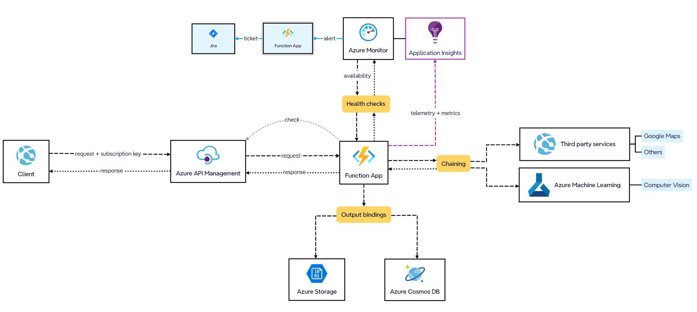
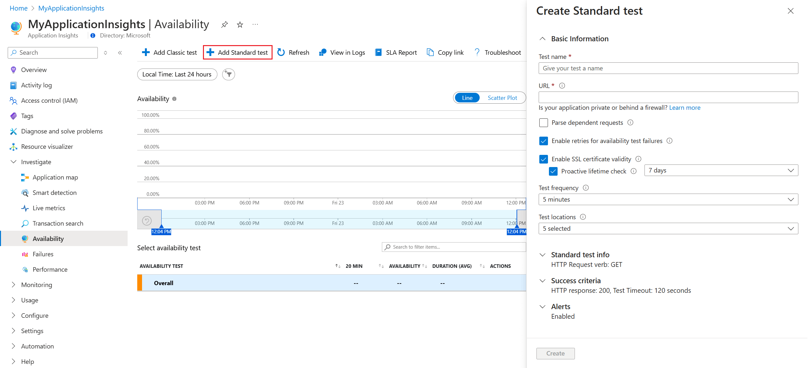

# Turing Challenge

## Top-level diagram



### 1. Authentication / Authorization

The client registers in **Azure API Management** developer portal and then makes a request to the Azure API Management API endpoint using their subscription key. Azure API Management validates the subscription key along with applicable quotas (policies) and forwards the request to the Function App. Before performing any action, the Function App can validate which products the subscriber has access to.

Request example:

```
GET https://turing-challenge.azure-api.net/api/endpoint?address=xxx
Ocp-Apim-Subscription-Key: <subscription_key>
```

### 2. Function App

The Function App executes a Durable Function using the Function [**Function chaining pattern**](https://learn.microsoft.com/en-us/azure/azure-functions/durable/durable-functions-overview?tabs=isolated-process%2Cnodejs-v3%2Cv1-model&pivots=csharp#chaining). Each activity performs necessary tasks within its own scope, such as calling third-party services, storing or reading data in a database, or saving files. Each Function also logs telemetry and custom metrics.


#### Considerations

The Function App could be *Consuption plan* because it supports
- 1.000.000 monthly request for free
- Up to 200 instances
- Up to 5 minutes timeout

Azure Function example:

```csharp
[Function("evaluate")]
public static async Task<object> EvaluateAsync(
    [OrchestrationTrigger] TaskOrchestrationContext context,
    string address)
{
    try
    {
        var plot = await context.CallActivityAsync<object>("GetPlotAsync", address);
        var satellite = await context.CallActivityAsync<object>("GetGoogleSatelliteAsync", plot.Coordinates);
        var street = await context.CallActivityAsync<object>("GetGoogleStreetAsync", plot.Coordinates);

        // ...

        var prediction = await context.CallActivityAsync<object>("GetPredictionAsync", plot.Coordinates);

        await context.CallActivityAsync<object>("SaveImageAsync", satellite);
        await context.CallActivityAsync<object>("SaveImageAsync", street);

        // ...

        return  await context.CallActivityAsync<object>("BuildAnswer", (plot, satellite, street, prediction));
    }
    catch (Exception)
    {
        // Error handling or compensation goes here.
    }
}
```

Response example:

```json
{
    "propertyOne": "",
    "propertyTwo": "",
    "imageSasUri": "https://accountName.blob.core.windows.net/xxx.png?sv=xxx&se=xxx&sr=xxx&sig=xxx"
}
```

### Health checks & Azure Monitor

By include Health checks API in Function App we can monitor availability and performance even third-party integrations.

Example request:

```
GET https://turing-challenge.azure-api.net/api/health-checks
Ocp-Apim-Subscription-Key: <subscription_key>
```

Example response:

```json
{
  "status": "Healthy",
  "details": {
    "AzureCosmosDB": {
      "status": "Healthy",
      "responseTime": "120ms",
      "details": {
        "database": "connected",
        "lastCheck": "2024-10-28T10:30:00Z"
      }
    },
    "AzureStorage": {
      "status": "Degraded",
      "responseTime": "300ms",
      "details": {
        "storageAccount": "connected",
        "lastCheck": "2024-10-28T10:30:00Z",
        "issues": "High response time"
      }
    },
    "GoogleMapsAPI": {
      "status": "Unhealthy",
      "responseTime": "500ms",
      "details": {
        "error": "503 Service Unavailable",
        "lastCheck": "2024-10-28T10:30:00Z",
        "message": "Google Maps API is currently unavailable"
      }
    }
  },
  "timestamp": "2024-10-28T10:30:05Z"
}
```

Now, with the response we have configured using the Health Checks API, we can connect it to the "availability" module in Azure Monitor and configure alerts in case a service malfunctions



With an alert, we can trigger another Azure Function or Logic App (for example) to create a Jira ticket.